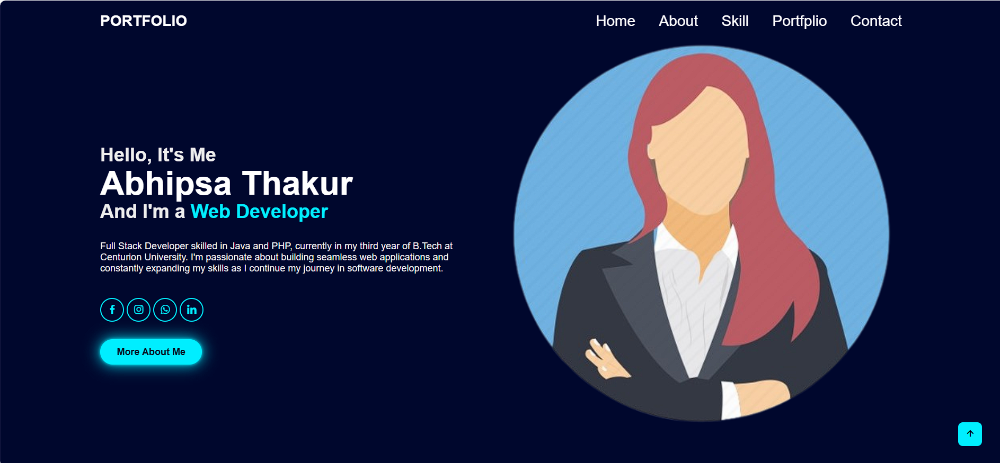
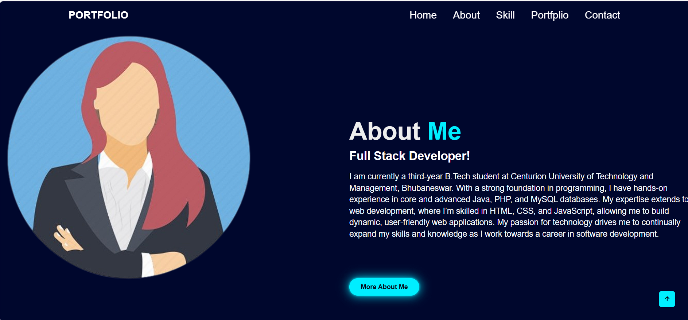
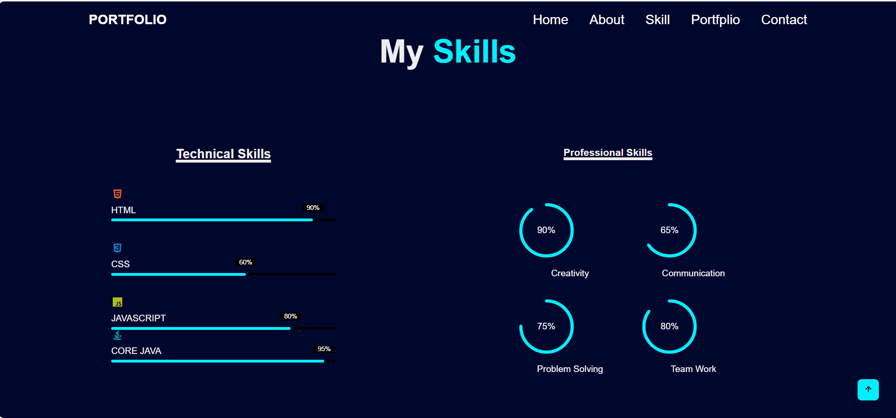
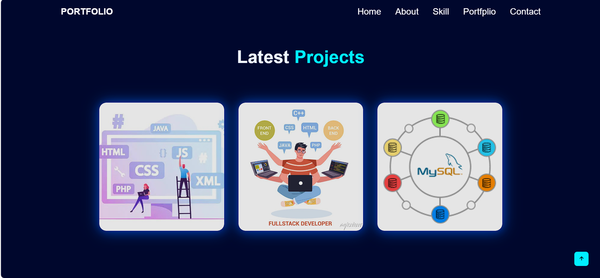
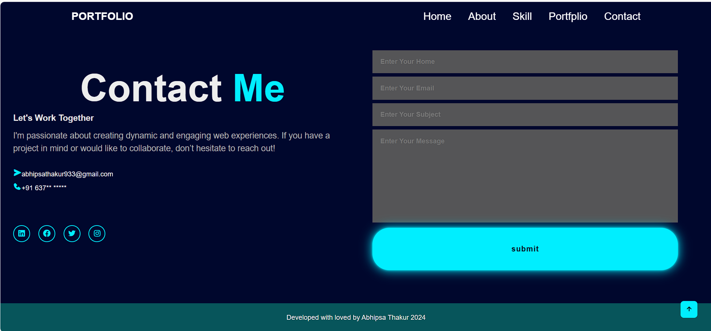

# Portfolio Website

This is a personal **Portfolio Website** developed using HTML, CSS, and Boxicons to showcase skills, services, projects, and contact information. It's designed to be fully responsive and visually appealing, reflecting your profile as a Full Stack Developer.

---

## 💼 Features

- **Responsive Navigation Bar**
- **Hero Section** with personal intro
- **About Me** section with a professional description
- **Services** section listing your offerings (Frontend, Full Stack, Database)
- **Technical & Professional Skills** displayed with progress indicators and radial charts
- **Portfolio/Projects** section with preview images
- **Contact Section** with social and communication details

---

## 🛠️ Technologies Used

- HTML5
- CSS3
- Boxicons (for social icons and progress visuals)
- Custom SVG graphics (for skill charts)

---

## 📸 Screenshots

 
 
 
 
 

---

## 📌 Setup Instructions

To run this project locally:

1. Clone or download the project:
   ```bash
   git clone https://github.com/your-username/portfolio-website.git
